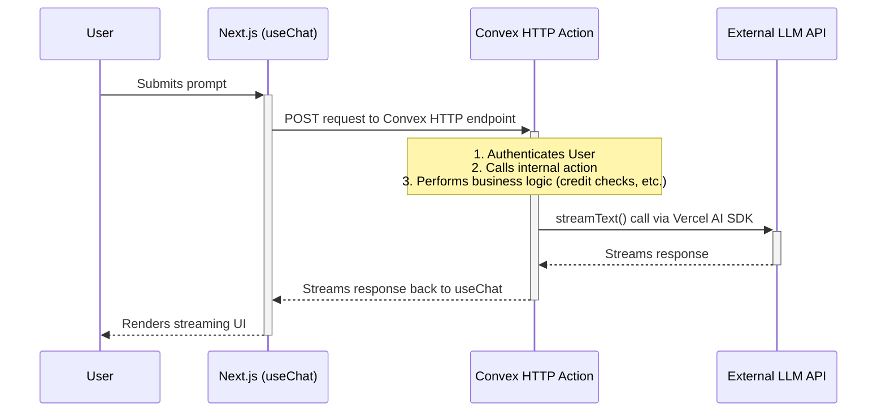

### 🏗️ **Document 2: T3.chat Superior Architecture Document**

```markdown
# T3.chat Superior Architecture Document

## 1. Introduction

This document outlines the complete technical architecture for **T3.chat Superior**. It serves as the single source of truth for all technical implementation, ensuring consistency, security, and scalability. The architecture is a direct two-tier model, designed for simplicity and performance.

## 2. High-Level Architecture

### 2.1. Architectural Style
The system is a **real-time, serverless web application**. It features a **Next.js frontend** that communicates directly with a **Convex backend** via secure HTTP actions. This two-tier architecture eliminates intermediate layers, reducing complexity and latency.

### 2.2. Component Interaction Diagram


## 3. Technology Stack

| Category | Technology | Rationale |
| :--- | :--- | :--- |
| **Frontend Framework** | Next.js (App Router)| For a modern, performant, and feature-rich user interface. |
| **UI Components** | ShadCN/UI | Provides a beautiful and accessible component library out-of-the-box. |
| **Styling** | Tailwind CSS | For rapid and consistent UI development. |
| **Backend**| Convex | For a real-time, serverless backend with an integrated database. |
| **Authentication** | `@convex-dev/auth`| Provides a secure, tightly integrated authentication system for Convex. |
| **AI SDK** | Vercel AI SDK | The core of our AI interaction layer, providing streaming, multi-modal support, and middleware capabilities. |
| **Language** | TypeScript | Ensures end-to-end type safety across the entire application. |

## 4. Backend Architecture (Convex)

### 4.1. Core Logic
All business logic, including credit checks, database operations, and calls to external LLMs, will be encapsulated within Convex `actions` and `internalMutations`. This enforces a secure, zero-trust model.

### 4.2. API Layer
The application will expose a single, secure **Convex HTTP Action** (defined in `convex/http.ts`) as the entry point for the frontend. This action will handle request authentication and route calls to the appropriate internal functions. This replaces the need for a separate API layer in Next.js.

### 4.3. Database Schema
The schema (defined in `convex/schema.ts`) will include tables for `users`, `chats`, `messages`, `attachments`, `subscriptions`, `plans`, and `modelConfigs`. It is designed to be extensible and support all features defined in the PRD.

## 5. Frontend Architecture (Next.js)

### 5.1. Data Fetching & State Management
All chat-related state and data fetching will be managed by the **`useChat` hook from `@ai-sdk/react`**. This hook will be configured to communicate directly with our Convex HTTP Action endpoint. This centralizes client-side logic and simplifies component design.

### 5.2. Component Structure
The UI will be built using the components provided by the `t3-chat-dashboard` starter. Components will be "dumb" where possible, with state and logic managed by higher-level components or the `useChat` hook.

## 6. Project & Deployment
*   **Structure:** The project will be a simplified monorepo containing the `convex` backend directory and the `src` directory for the Next.js frontend at the root level.
*   **Deployment:** The application will be deployed as a unified project using the Convex CLI (`npx convex deploy`), which handles both the backend functions and the Next.js frontend hosting.
```